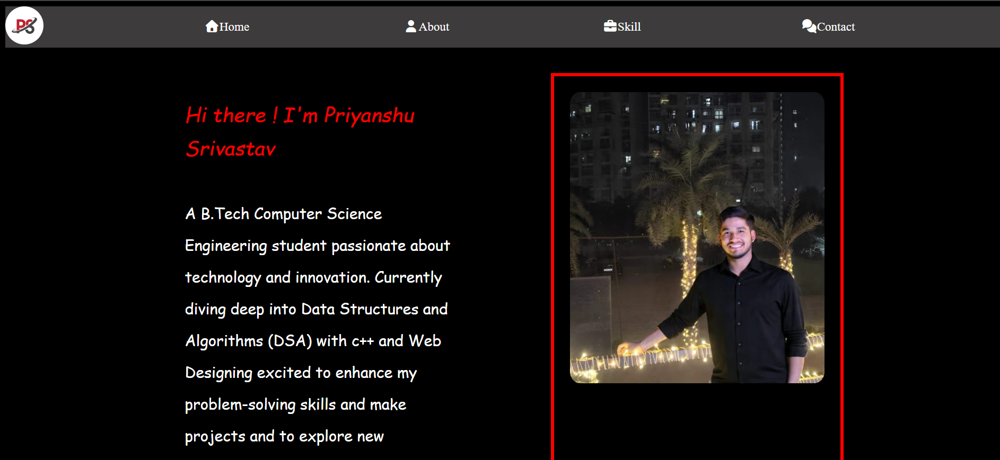
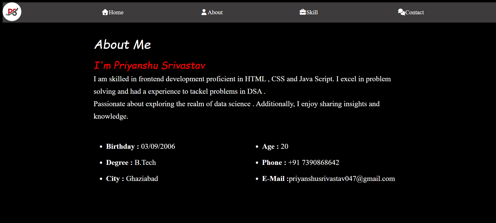
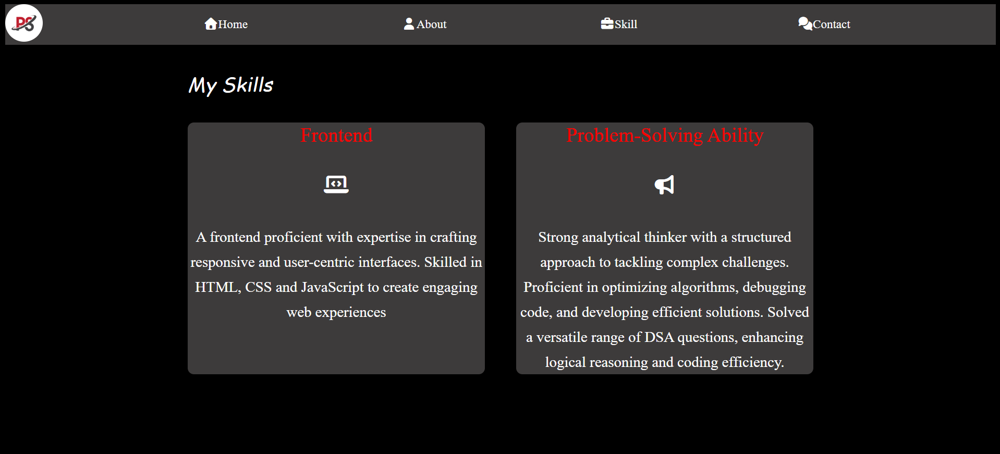
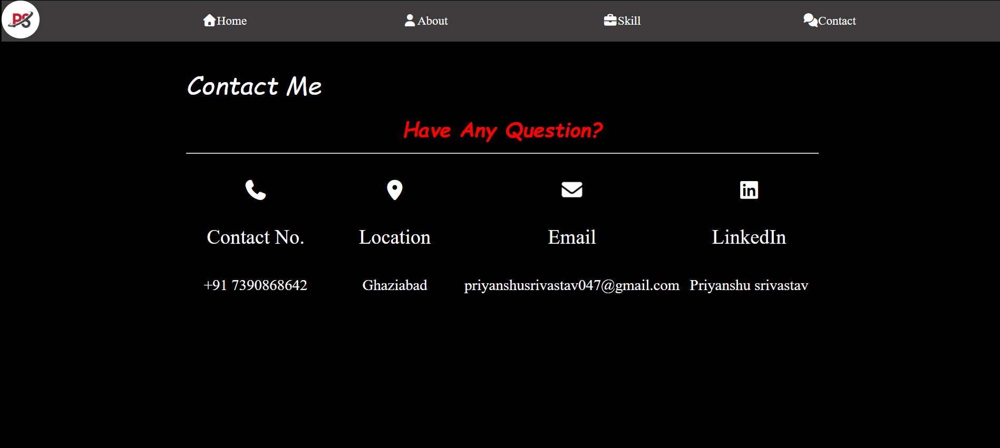

# Priyanshu-portfolio Website
🔗 Live Demo 
Visit the Website:
https://priyanshu-portfolio-roan-sigma.vercel.app/

📌 Project Overview :

This project is a personal portfolio website built to showcase my skills, projects, and achievements as a Computer Science student.

The portfolio highlights my journey in programming, web development, and problem solving, while providing an easy way for recruiters and collaborators to view my work and contact me.

🚀 Features :

• Personal developer portfolio website
• Introduction / About section
• Projects showcase
• Skills and technologies section
• Contact information
• Clean and responsive design
• Deployed online for public access

🛠️ Technologies Used

• HTML5
• CSS3
• JavaScript
• Vercel for deployment

 Learning Outcomes :

Through this project, I learned:
• Building a personal portfolio website
• Structuring webpages using HTML
• Styling layouts with CSS
• Creating responsive webpage sections
• Deploying a website using Vercel

Author ::

Priyanshu Srivastav

GitHub
https://github.com/priyanshusrivastava049-a

LinkedIn
https://www.linkedin.com/in/priyanshu-srivastav-313989345/

**Website Preview**

 

